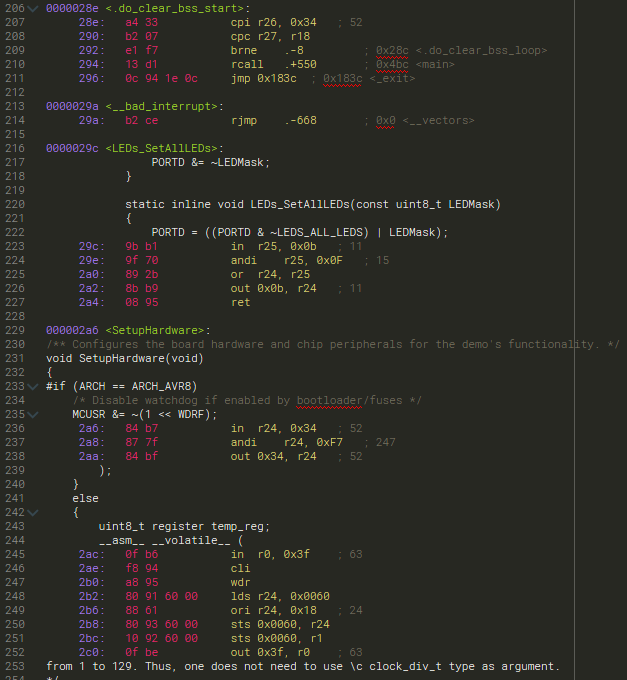

# Sublime Text Syntax - Generic GNU GAS

This is a Sublime Text 3 syntax definition for GNU GAS listing files, produced
by GCC. These files contain a mixed C/C++ and the corresponding compiled 
assembly code.

This syntax definition provides some basic highlighting to make these files
easier to read. It is a generic syntax, thus should work regardless of the
architecture being used.

Sample:

# License

See [license information here](LICENCE.txt).
